# Evidencias — TP1

## 1. Push directo a main rechazado
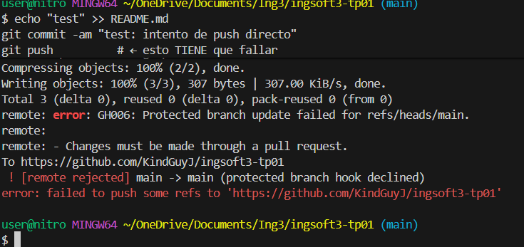
Intenté hacer `git push` directo a `main` después de un commit local, y GitHub lo rechazó con un
error de tipo "protected branch hook declined". Esto confirma que la protección de rama está activa
y que alcanza incluso al administrador del repositorio (dueño de la cuenta), ya que tenía activada
la opción "Do not allow bypassing the above settings".

## 2. Aviso de conflicto en el Pull Request
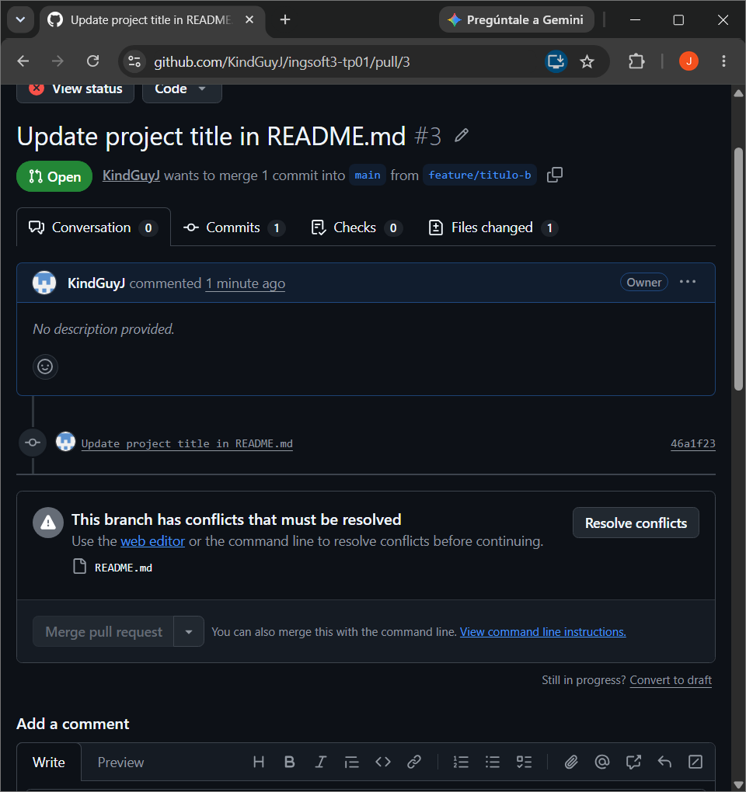
Al crear dos ramas (`feature/titulo-a` y `feature/titulo-b`) partiendo ambas de `main` y modificando
la misma línea del `README.md`, mergeé primero el PR de la rama A. Al intentar mergear el PR de la
rama B, GitHub mostró el aviso de que no se puede mergear automáticamente porque hay conflictos
("This branch has conflicts that must be resolved").

## 3. Marcadores de conflicto en el archivo
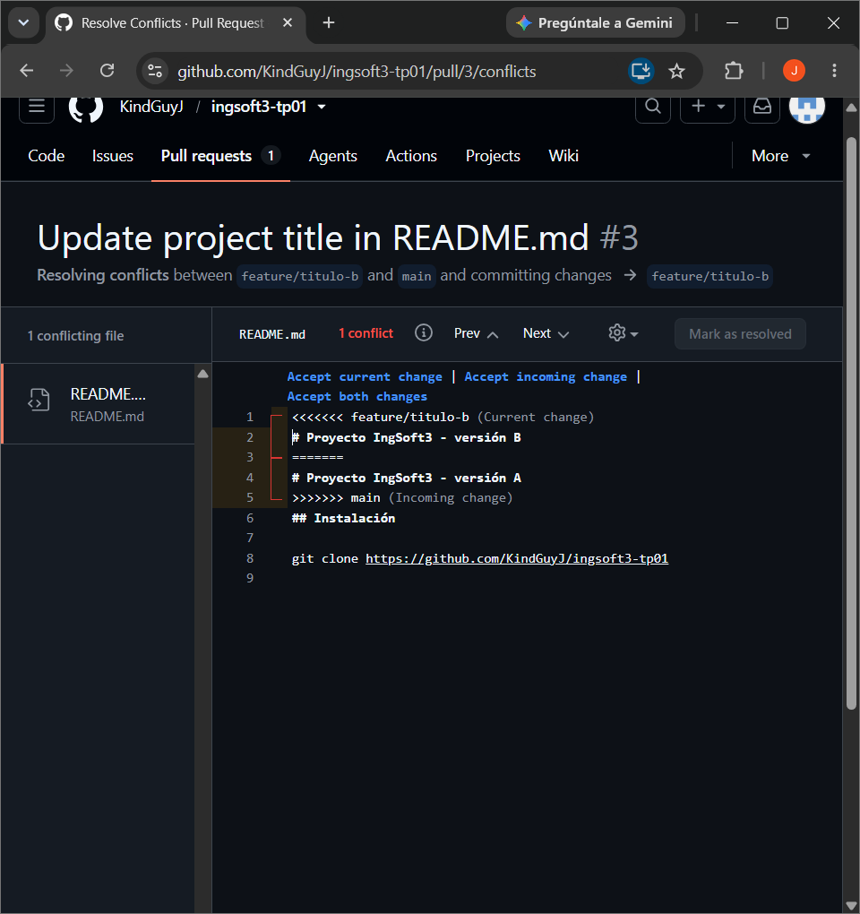
Al abrir el editor de resolución de conflictos de GitHub (Resolve conflicts) sobre el PR de la rama
B, se veían los marcadores `<<<<<<<`, `=======` y `>>>>>>>` delimitando las dos versiones en
conflicto de la primera línea del `README.md`: una proveniente de `feature/titulo-b` (mi rama) y
otra ya integrada en `main` desde `feature/titulo-a`.

## 4. Release v1.0.0 publicada
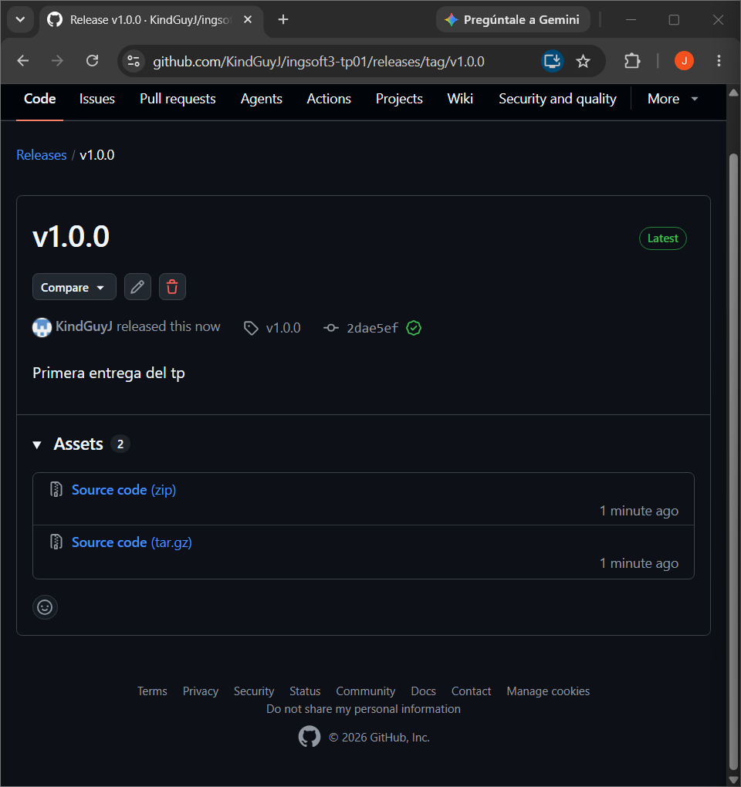
Después de crear el tag `v1.0.0` sobre `main` y subirlo con `git push origin v1.0.0`, publiqué la
release correspondiente desde la sección "Releases" del repositorio, con el título `v1.0.0` y notas
describiendo qué incluye esta versión (protecciones de rama, flujo de Pull Requests y conflicto
resuelto).
---

# Evidencias — TP2

## 1. El sistema levanta desde cero

```
$ cp .env.example .env
$ docker compose up -d --build
```

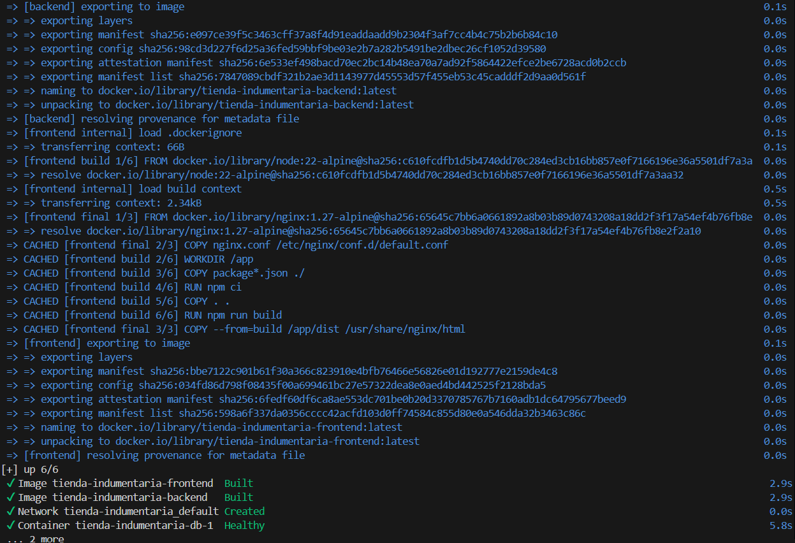

`db` llega a `healthy` **antes** de que arranque el backend: eso es el
`condition: service_healthy` del `depends_on`, no una casualidad de tiempos.

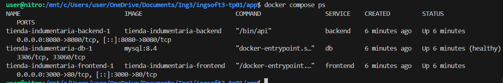

Y el catálogo, servido por nginx en `localhost:3000`, consumiendo `/api` del backend por
la red interna:

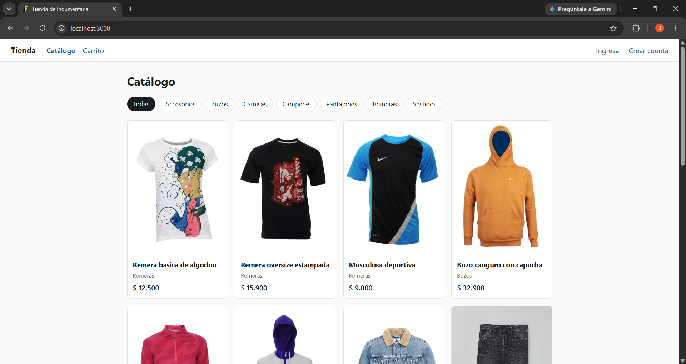

## 2. Comunicación entre servicios

El backend no conoce ninguna IP: tiene `DB_HOST=db` y el DNS embebido de Docker
(`127.0.0.11`) resuelve ese nombre dentro de la red del proyecto.

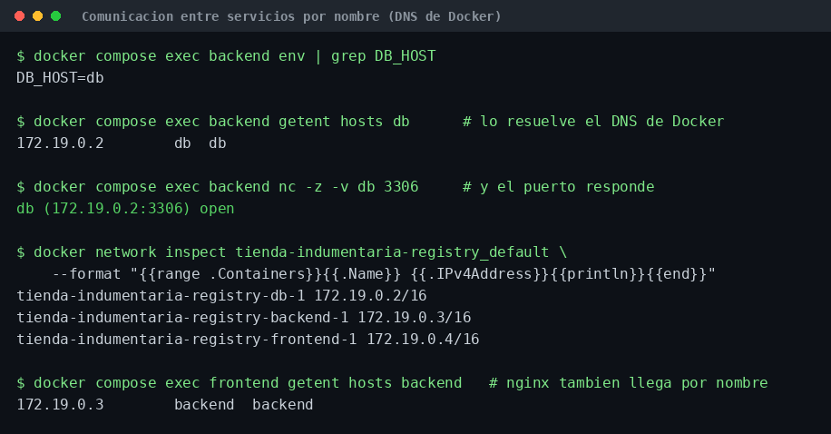

Lo que prueba la captura, leída de arriba abajo: la variable dice `db`, no una IP;
`getent hosts db` la resuelve a `172.19.0.2`; el puerto 3306 responde ahí; y el
`network inspect` confirma que `172.19.0.2` es efectivamente el contenedor de la base. El
último comando cierra el otro salto: nginx llega a `backend` por nombre, que es lo que
hace funcionar el `proxy_pass`.

**Por qué importa:** esas IPs las asigna Docker y cambian en cada `up`. Si el backend
tuviera una escrita, el sistema se rompería solo al recrear los contenedores.

## 3. Prueba de persistencia

Se corrió sobre el stack de registry, que es descartable: así el `down -v` no toca los
volúmenes del stack de desarrollo.

Se miran **los dos volúmenes a la vez**, que es lo que hace la prueba completa: `db_data`
(la base) y `uploads_data` (las fotos que sube el admin). El estado se resume en tres
líneas en vez de volcar el catálogo entero, que con el seed son 15 productos:

```bash
# la base: cuántos productos hay, y si sigue el producto de prueba
curl -s localhost:8080/api/productos | jq 'length'
curl -s -o /dev/null -w '%{http_code}' localhost:8080/api/productos/$PID

# el volumen de uploads: si la foto subida se sigue sirviendo por nginx
curl -s -o /dev/null -w '%{http_code}' localhost:3000$FOTO
```

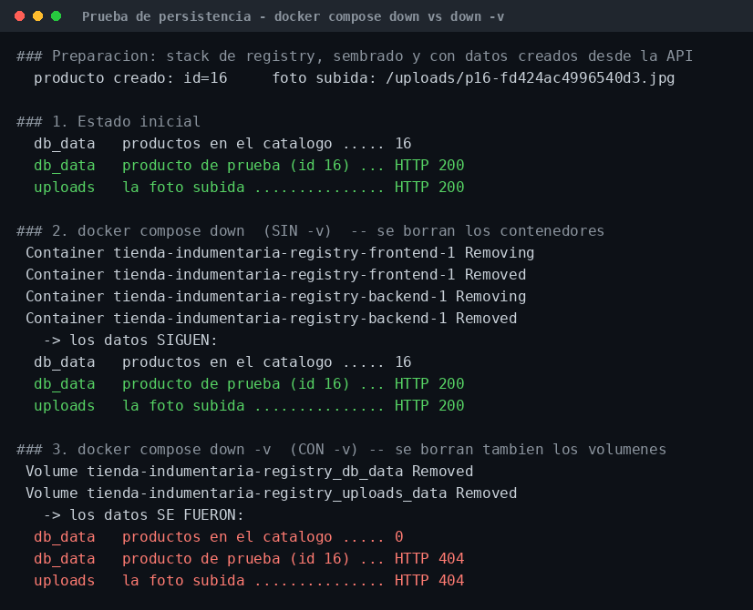

**Lo que demuestra:** tras `docker compose down` los contenedores se destruyen y se
vuelven a crear, y los datos siguen (16 productos, el de prueba en 200, la foto en 200) —
los volúmenes nombrados sobreviven al contenedor. Tras `docker compose down -v` los
volúmenes se borran explícitamente y todo se va (0 productos, 404 y 404).

Ese contraste es el punto: sin volumen, cada `down` habría vaciado la base.

## 4. Tamaño de imágenes: multi-stage vs SDK

> ⚠️ Hay que traer primero las dos bases: con el image store de containerd (Docker 29) la
> imagen de la etapa de build **no** queda listada después del build, y los comandos salen
> vacíos sin que nada falle.
> `docker pull golang:1.24-alpine && docker pull alpine:3.20`

```
$ docker images --format "{{.Repository}}:{{.Tag}}\t{{.Size}}"

golang:1.24-alpine    395MB     ← la que COMPILA (toolchain de Go completo)
alpine:3.20          12.2MB     ← la base que EJECUTA
tienda-backend       37.5MB     ← el resultado del multi-stage
tienda-frontend      79.7MB
```

**La diferencia:** la imagen final del backend pesa **37,5 MB contra los 395 MB** del
entorno de compilación — una décima parte, un ahorro de ~357 MB (90%). De esos 37,5 MB,
12,2 son la base Alpine: el binario de Go aporta unos 25 MB y no arrastra ni el
compilador, ni el código fuente, ni los módulos descargados.

Que el binario sea estático (`CGO_ENABLED=0`) es lo que permite que la etapa final sea
`alpine:3.20` pelada, sin runtime ni librerías del sistema.

## 5. Imágenes publicadas en el registry

Publicadas en `ghcr.io/kindguyj/tienda-backend:v2.0.0` y
`ghcr.io/kindguyj/tienda-frontend:v2.0.0`.

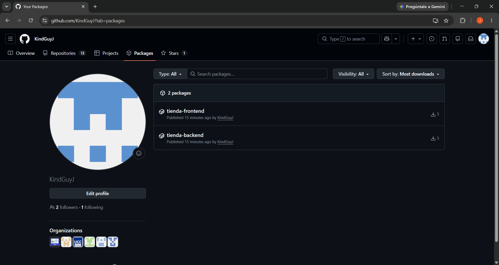

**`docker tag` no copia la imagen, le pone un segundo nombre.** El mismo ID bajo los dos
nombres es la prueba, y por eso el disco no crece:

```
tienda-indumentaria-backend:latest       ->  23b3b74ce1c8  (37.5MB)
ghcr.io/kindguyj/tienda-backend:v2.0.0   ->  23b3b74ce1c8  (37.5MB)
tienda-indumentaria-frontend:latest      ->  e8b98fc6fba4  (79.7MB)
ghcr.io/kindguyj/tienda-frontend:v2.0.0  ->  e8b98fc6fba4  (79.7MB)
```

**La visibilidad Public verificada sin credenciales.** Este chequeo importa porque
`docker manifest inspect` engaña: con la sesión abierta responde OK aunque el paquete sea
privado. Pidiendo un token anónimo al registry:

```
$ curl -s "https://ghcr.io/token?scope=repository:kindguyj/tienda-backend:pull"
```

Con los paquetes en **Private** devolvía `{"errors":[{"code":"UNAUTHORIZED"}]}`; después
de pasarlos a **Public**, el manifest responde `HTTP 200` en los dos.

## 6. Levantar desde el registry sin construir

El compose del registry declara `name: tienda-indumentaria-registry`: es un **proyecto de
Compose aparte**, con volúmenes propios. Por eso arranca con la base vacía y la prueba
demuestra algo — si algo faltara dentro de la imagen publicada, se vería acá.

Preparación (sesión cerrada y las imágenes borradas de verdad, no solo destagueadas — por
eso aparece `Deleted: sha256:...`):

```
$ docker compose down                 # sin -v: los volúmenes del stack de build quedan
$ docker logout ghcr.io
$ docker rmi ghcr.io/kindguyj/tienda-backend:v2.0.0 ghcr.io/kindguyj/tienda-frontend:v2.0.0 \
             tienda-indumentaria-backend:latest tienda-indumentaria-frontend:latest
Untagged: ghcr.io/kindguyj/tienda-backend:v2.0.0
Untagged: tienda-indumentaria-backend:latest
Deleted: sha256:23b3b74ce1c80754c16a01dbc69fd3c20cb16bf1c5c4ba1e1031dc44b02c92f7
Untagged: ghcr.io/kindguyj/tienda-frontend:v2.0.0
Untagged: tienda-indumentaria-frontend:latest
Deleted: sha256:e8b98fc6fba468115b60cd1458a80bce097043aa353b79f6f4c44b09c6f414e6
```

No hace falta `docker builder prune -af`: borra el cache de build de toda la máquina y el
cache de construcción no interviene en un `pull`. Lo que hace que la descarga sea real es
haber borrado las imágenes.

```
$ docker compose -f docker-compose.registry.yml up -d
 Image ghcr.io/kindguyj/tienda-backend:v2.0.0 Pulled
 Image ghcr.io/kindguyj/tienda-frontend:v2.0.0 Pulled
 Volume tienda-indumentaria-registry_uploads_data Created
 Volume tienda-indumentaria-registry_db_data Created
 Container tienda-indumentaria-registry-db-1 Healthy
 Container tienda-indumentaria-registry-backend-1 Started
 Container tienda-indumentaria-registry-frontend-1 Started
```

Estado inicial, que es la prueba del aislamiento entre proyectos:

```
$ curl -s localhost:8080/healthz          → {"status":"ok"}  [HTTP 200]
$ curl -s localhost:3000/api/productos    → []               [HTTP 200]
$ curl -s -o /dev/null localhost:3000/                        [HTTP 200]
```

El seed vive dentro de la imagen publicada, así que se puede sembrar sin el código fuente:

```
$ docker compose -f docker-compose.registry.yml exec backend /bin/seed
15 productos cargados
seed terminado
```

Y el sistema entero, corriendo sobre imágenes bajadas del registry:

```
$ BASE=http://localhost:3000 ./smoke-test.sh
OK: 48 verificaciones, todas en verde.
```

> ⚠️ Los dos composes publican los mismos puertos, así que no conviven: hay que hacer
> `docker compose down` de uno antes de levantar el otro.

## 7. Tests

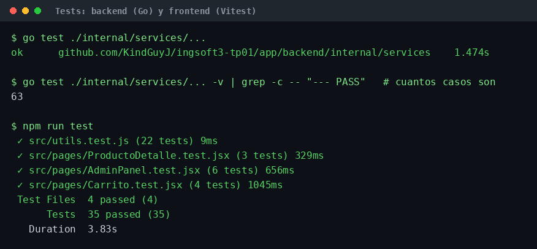

**63 casos en el backend** (los servicios, que es donde viven las reglas de negocio) y
**35 en el frontend**. Los del backend corren sin MySQL y sin Gin: los services reciben un
repositorio falso en memoria, que es lo que los hace rápidos y lo que va a permitir que el
pipeline del TP4 los corra en cada push.

> Los tests **no** se ejecutan dentro del Dockerfile: van al pipeline del TP4. Meterlos en
> el build haría que un test roto rompa la construcción de la imagen, que es justo lo que
> el pipeline debería atrapar antes y con mejor diagnóstico.

## Nota sobre las capturas

Las imágenes de `localhost:3000`, `docker compose ps`, `docker compose up` y la pestaña
Packages son capturas de pantalla.

Las tres de terminal —`red-por-nombre-de-servicio.png`, `persistencia-volumenes.png` y
`tests.png`— son **renderizados de la salida real** de esos comandos: se corrieron, se
guardó su salida literal a archivo y se la dibujó como imagen para que se lea. El texto no
se editó. Los comandos están todos acá arriba, así que cualquiera puede volver a correrlos
y comparar.
